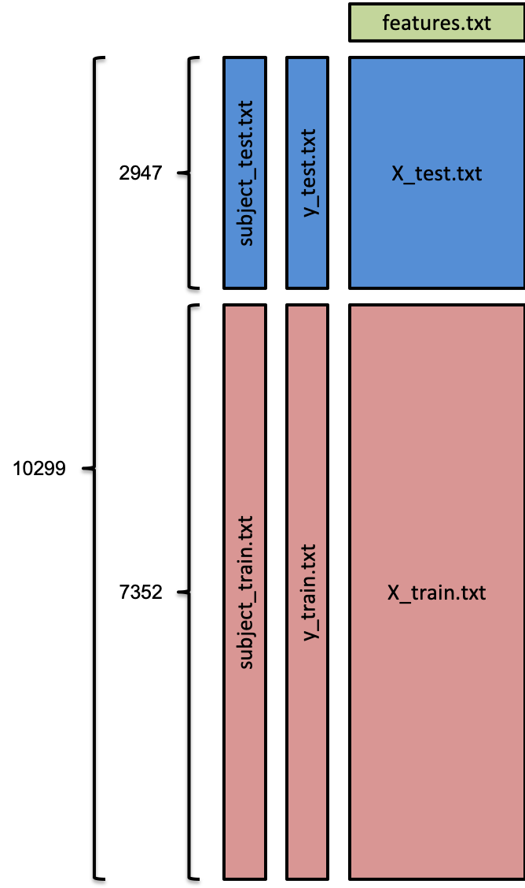

### READ ME
#### Coursera - Getting and Cleaning Data - Course Project<br/><br/>

This file explains what I have done to fulfil the course project.<br/>

I have included four files in this repository:<br/>

1. **run_analysis.R** - The script of all the operations that I have done on the data.<br/>
2. **averages.txt** - The data set resulting from the step 5 of the instructions given on the coursera website.<br/>
3. **CodeBook.md** - Describing the variables.<br/>
4. **README.md** - Describing how the script works.<br/>


To read in the averages.txt file, please use the following script:

```{r}
library(readr)
read_delim("averages.txt", delim = " ")
```
<br/>

The initial data from the coursera website is from the accelerometer and gyroscope of a smartphone used to investigate six different activities among 30 volunteer participants. The purpose of this project is to organize the data in a way that follows the principles of tidy data, which will facilitate further exploratory and inferential analyses. <br/>

After extracting the zip file downloaded from the coursera website, a folder named "UCI HAR Dataset" was created, which contained many data files and two instruction files (*README.txt* and *features_info.txt*). Here, I want to describe the data files, their dimentions, and how I put them together in one data set: <br/>


| |Data file name |Dimention | Description |
|:- |:-- |:- |:-----------|
| 1 | ***activity_labels.txt*** | 6 x 2 | the labels of six different activities (namely WALKING, WALKING_UPSTAIRS, WALKING_DOWNSTAIRS, SITTING, STANDING, LAYING) and their associated number coded in other data files. |
| 2 | ***features.txt*** | 561 x 1 | the names of 561  different measrement calculations. |
| 3 | ***test/subject_test.txt*** | 2947 x 1 | the participant number for each observation (window). There are 9 unique participants (from the total of 30) in the test group. |
| 4 | ***test/y_test.txt*** | 2947 x 1 | the numeric code of the six activities for each observation (window) in the test group. |
| 5 | ***test/X_test.txt*** | 2947 x 561 | the normalized measured value (between -1 and +1) of each of the 561 different features for each observation (window) in the test group. |
| 6 | ***train/subject_train.txt*** | 7352 x 1 | the participant number for each observation (window). There are 21 unique participants (from the total of 30) in the train group. |
| 7 | ***train/y_train.txt*** | 7352 x 1 | the numeric code of the six activities for each observation (window) in the train group. |
| 8 | ***train/X_train.txt*** | 7352 x 561 | the normalized measured value (between -1 and +1) of each of the 561 different features for each observation (window) in the train group. |


**Note:** I used "tidyverse" library (which automatically loads dplyr, readr, and some other useful packages), instead of base R functions, for faster and easier reading and manipulation of the data. <br/>
<br/>
In my script (run_analysis.R), I have followed the five steps instructed by the course: <br/>

* **Step 1:** I put the data files above together in one data set like this (please note that the dimentions of the diagram are not accurate):
<br/>
*Note:* As the contents of the "Inertial Signals" folder in both test and train sets are raw data, and the contents of the other files have been processed, I did not merge the files inside the "Inertial Signals" folders with my main data set, as it opposes tidy data principles.

<br/>

<center>  </center>

<br/>

* **Step 2:** I extracted 33 measures of mean and 33 measures of standard deviation. <br/>
*Note:* There are both "mean" and "meanFreq" among the features (variables). The question asks for mean AND standard deviation. The number of features containing the phrase "std" is 33. This number for phrases "mean" and "meanFreq" is 46 and 13, respectively, and when we exclude "meanFreq" from "mean", the number of matching features would be 33, just as this number for "std". As there is no definite instruction on this issue, I am going with my understanding of the matter and that is I should not include the "meanFreq" in my tidy data set. 

* **Step 3:** I replaced the numeric code of the six activities for each observation with its label counterpart from the *activity_labels.txt* file.

* **Step 4:** I labeled each column with a proper column name. I used abbreviated name parts to prevent the column names from becoming too long. The details of the labeling principles and the abbreviations that I used are in the *CodeBook.md* file.

* **Step 5:** I created a second tidy data set containing the mean of each of the 66 features (33 mean features and 33 standard deviation features) for each subject and each activity. As there are 30 subjects (participants) and six activities, my final data set (*averages.txt*) has 180 rows, as well as 68 columns (one for *subjectNumber*, one for *activityLabel*, plus the 66 extracted features).
<br/>

**Note: Further details of my solution for this project can be found in the comment sections throughout the *run_analysis.R* file.**